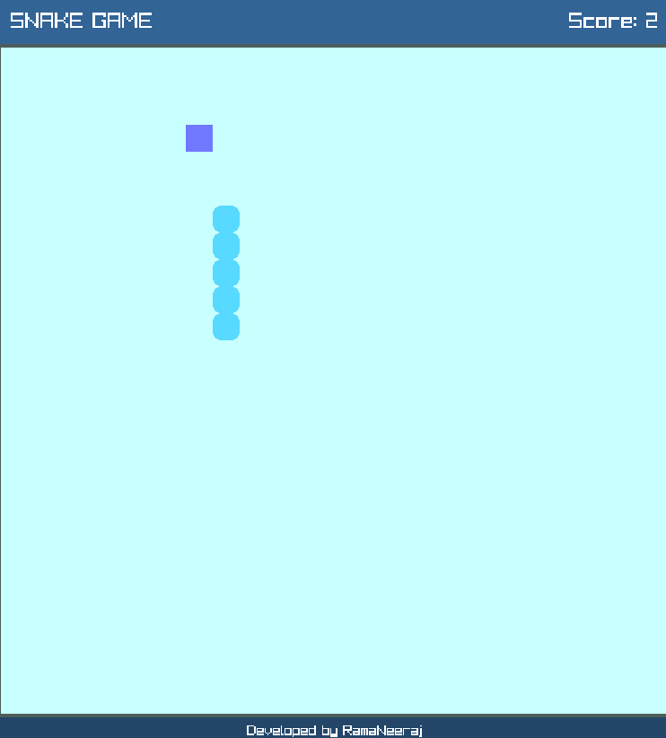

# 🐍 Snake Game (C++ & Raylib)

A modern implementation of the classic **Snake Game** developed in **C++** using the **Raylib** graphics library.

The game features smooth gameplay, score tracking, collision detection, and a clean user interface.

---

## 🎮 Features

- Classic Snake gameplay
- Smooth grid-based movement
- Random food generation
- Snake grows after eating food
- Score tracking
- Wall collision detection
- Self-collision detection
- Game Over screen
- Restart the game by pressing any arrow key
- Clean and minimal UI

---

## 🛠️ Technologies Used

- **Programming Language:** C++
- **Graphics Library:** Raylib
- **Compiler:** g++
- **IDE:** Visual Studio Code
- **Version Control:** Git & GitHub

---

## 📁 Project Structure

```text
Snake-Game/
│── main.cpp
│── SnakeGame.exe
│── README.md
└── assets/            (Optional)
```

---

## ▶️ Running the Game

### Option 1: Run the Executable (Recommended)

1. Download `SnakeGame.exe`.
2. Double-click the executable.
3. Enjoy the game!

---

### Option 2: Compile from Source

#### Requirements

- C++ Compiler (g++)
- Raylib Library

Compile using:

```bash
g++ main.cpp -o SnakeGame.exe $(pkg-config --cflags --libs raylib)
```

Run the executable:

```bash
./SnakeGame.exe
```

---

## 🎮 Controls

| Key | Action |
|------|--------|
| ↑ | Move Up |
| ↓ | Move Down |
| ← | Move Left |
| → | Move Right |

After a Game Over, press any arrow key to start a new game.

---

## 📖 Gameplay

- Control the snake using the arrow keys.
- Eat food to increase your score.
- Each food item makes the snake grow longer.
- Avoid colliding with the walls.
- Avoid colliding with your own body.
- The game ends when a collision occurs.

---

## 📸 Screenshots



---

## 📥 Download

The Windows executable is included in this repository.

Simply download:

```
SnakeGame.exe
```

and run it.

---

## 🚀 Future Improvements

- Sound effects
- Background music
- High score saving
- Difficulty levels
- Pause/Resume feature
- Multiple food types
- Custom themes
- Power-ups

---

## 👨‍💻 Developer

**Rama Neeraj Dungala**

Developed as a personal project to practice:

- C++
- Object-Oriented Programming (OOP)
- Data Structures
- Game Development using Raylib

---
